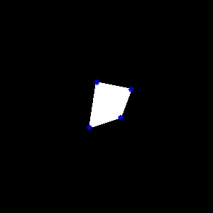
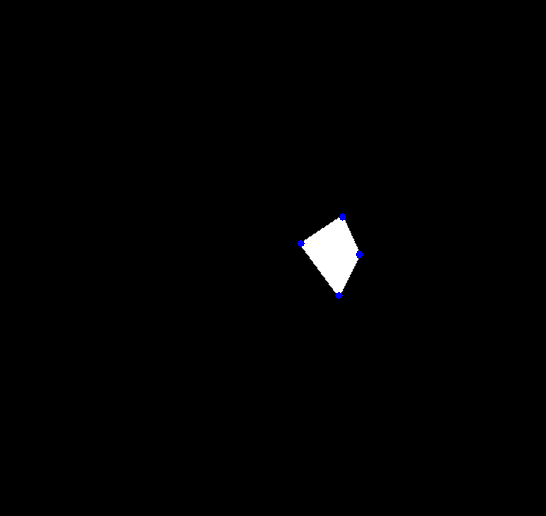

# Corner Detection and Least Squares Optimization

The objective was to create a 300x300 square with a white irregular quadrilateral in it, rotate and translate the image about the original center and detect corners in the two images.
After this, the rotation and translation in the second image was to be recovered so that one can define the original image again using the the transformed second image using least squares optimization.

Detected corners in the original image are-

  

Detected corners in the transformed image are-

  

